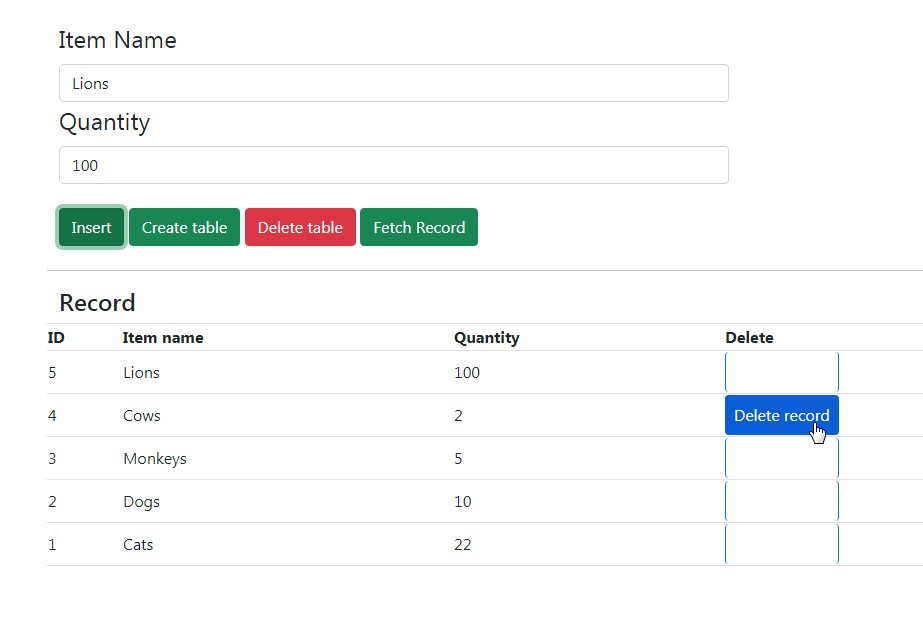

<h1 align="center">
    <strong>Database with jQuery</strong>
</h1>
<h3 align="center">
    Create Read and Delete data in database with jQuery
</h3>

## Features
* *Two input fields('item name', 'quantity')*
* *Four buttons('insert', 'create table', 'delete table', 'fetch record')*
* *Data output in table format*
* *Delete button for every record*
* *Warnings and notifications on every action*

